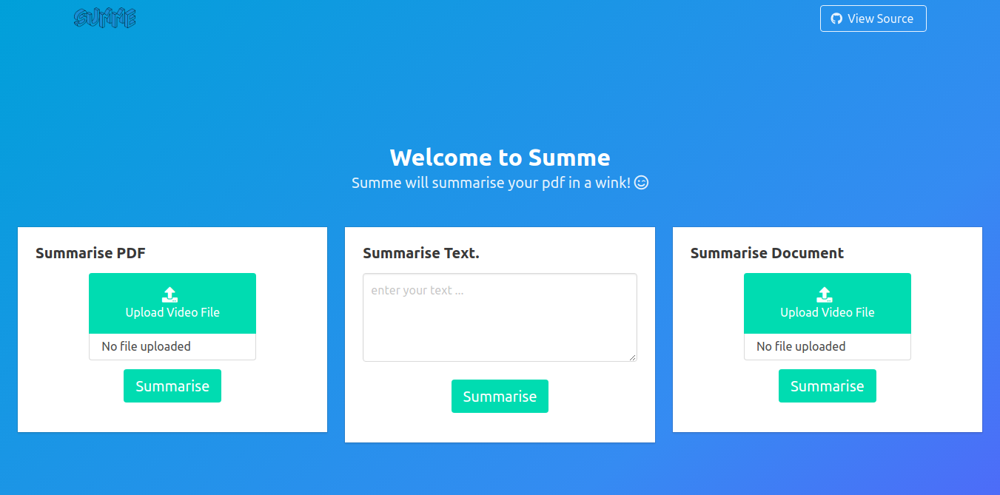

# TWEEZY

 

Summarises any pdf containing texts

## How to run ?
- clone this repo
- run the following commands in the terminal from the cloned folder
- `virtualenv venv`
- `source venv/bin/activate`
- `pip install -r requirements.txt`
- `python manage.py migrate`
- `python manage.py runserver`
- open `localhost:8000` in your browser

# Screenshots

